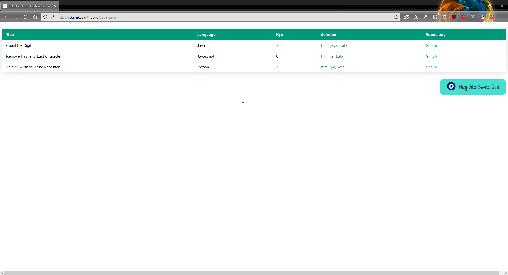

# Celal Karakoç - Codewars

## Prerequisites

python libraries:

    beautifulsoup4
    selenium
    Jinja2

## Setup

Download [geckodriver](https://github.com/mozilla/geckodriver/releases)
or [chromedriver](https://chromedriver.chromium.org/downloads) and put it into the `./drivers` folder.

Add your [codewars](https://www.codewars.com) username and password in the `config.py` file
(copy-paste `config.py.example` > `config.py`).

Fill in remaining variables in your `config.py` file.

The `extensions.json` file in `assets\json\ ` does not support all programming languages. Add the programming languages
you want it to support based on the json-object structure. You can search
through [this gist](https://gist.github.com/ppisarczyk/43962d06686722d26d176fad46879d41) for examples.

Delete the `kata` folder with everything in it.

Modify the `assets/templates/home.html` to not include the `buymeacoffee` script, so just delete the
`bmc-button`-`<script>` tag.

## Run

`python main.py --url <url> --driver <'geckodriver' or 'chromedriver'> --headless`

`--url` = `https://www.codewars.com/kata/<some hash>/train/<some programming language>`

Example usage: `python main.py --url 'https://www.codewars.com/kata/56bc28ad5bdaeb48760009b0/train/python' --driver 'geckodriver' --headless`

## Result 

## TODO

- Implement logging properly
 
 

